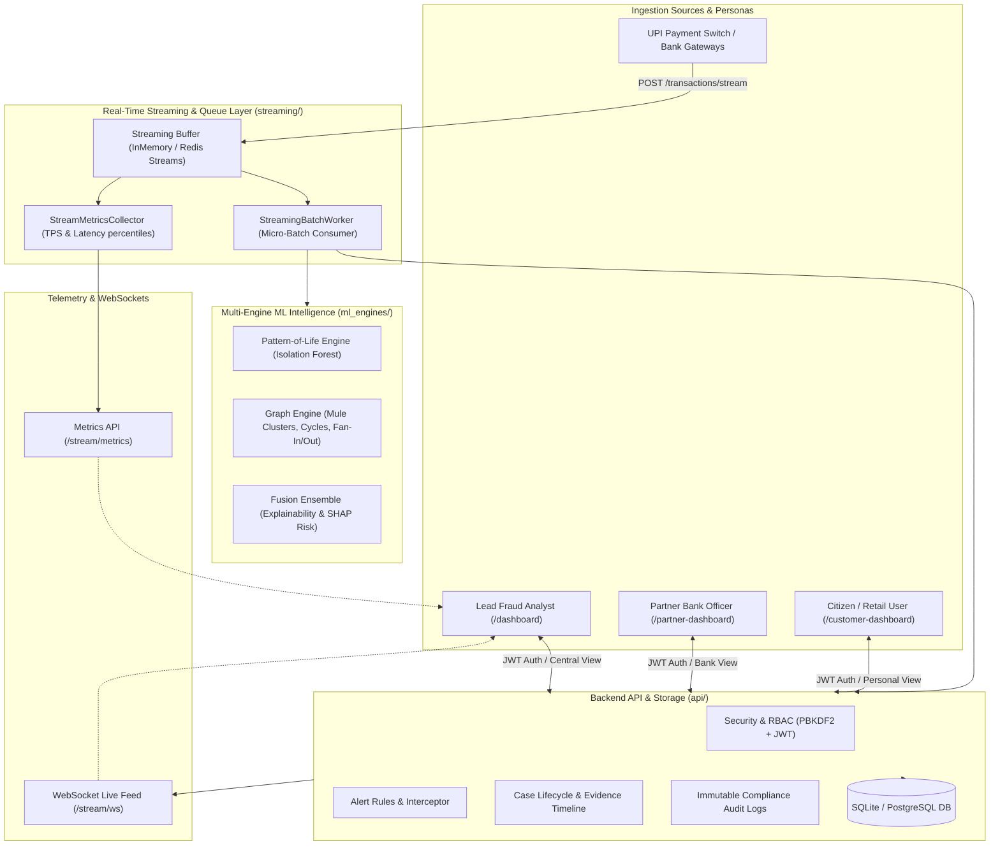
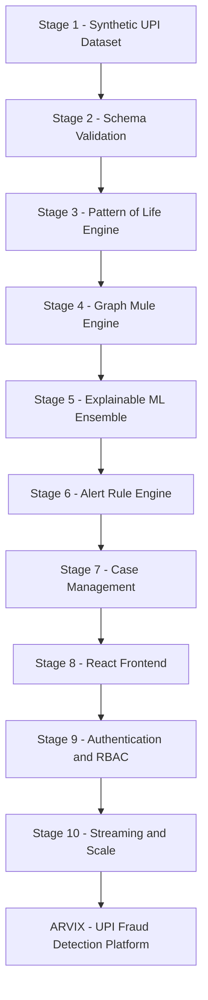
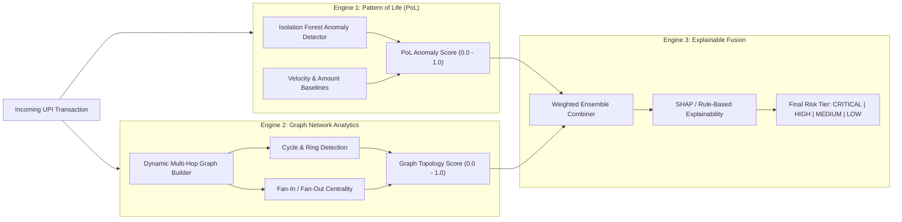

# ARVIX — Enterprise Real-Time UPI Fraud Detection & Investigation System

[](file:///c:/Users/Drishaant%20Sarkar/Desktop/SIH/SIH_Project-main/tests)
[](file:///c:/Users/Drishaant%20Sarkar/Desktop/SIH/SIH_Project-main/api)
[](file:///c:/Users/Drishaant%20Sarkar/Desktop/SIH/SIH_Project-main/frontend)
[](file:///c:/Users/Drishaant%20Sarkar/Desktop/SIH/SIH_Project-main/streaming)
[](file:///c:/Users/Drishaant%20Sarkar/Desktop/SIH/SIH_Project-main/api/security.py)

**ARVIX** is a comprehensive, institutional-grade UPI fraud detection, AML graph intelligence, and real-time inter-bank investigation system. Built for high-throughput payment switches (NPCI, Partner Banks, and Payment Aggregators), ARVIX delivers millisecond-level transaction interception, multi-modal machine learning risk scoring, graph network clustering, multi-persona portals, and an immutable regulatory audit trail.

---

## System Architecture



---

## 10-Stage Implementation Roadmap & Milestones

The project was engineered through a 10-stage architecture:



### Detailed Stage Breakdown:

| Stage | Focus Area | Key Components & Files | Status |
|---|---|---|---|
| **Stage 1** | **Synthetic UPI Dataset Generator** | [main.py](file:///c:/Users/Drishaant%20Sarkar/Desktop/SIH/SIH_Project-main/main.py), [generators/](file:///c:/Users/Drishaant%20Sarkar/Desktop/SIH/SIH_Project-main/generators), [scenarios/](file:///c:/Users/Drishaant%20Sarkar/Desktop/SIH/SIH_Project-main/scenarios) (Account Takeover, Mule Network, Fan-In, Fan-Out, Rapid Pass-Through, Circular Flow) | Complete |
| **Stage 2** | **Schema Ingestion & Database Layer** | [data/schemas/transaction_schema.json](file:///c:/Users/Drishaant%20Sarkar/Desktop/SIH/SIH_Project-main/data/schemas/transaction_schema.json), [api/database.py](file:///c:/Users/Drishaant%20Sarkar/Desktop/SIH/SIH_Project-main/api/database.py), [api/models.py](file:///c:/Users/Drishaant%20Sarkar/Desktop/SIH/SIH_Project-main/api/models.py), Alembic migrations | Complete |
| **Stage 3** | **Pattern-of-Life (PoL) Model** | [ml_engines/pattern_of_life/](file:///c:/Users/Drishaant%20Sarkar/Desktop/SIH/SIH_Project-main/ml_engines/pattern_of_life) (Isolation Forest baseline, velocity profiles, time-of-day behavioral modeling) | Complete |
| **Stage 4** | **Graph Detection Engine** | [ml_engines/graph_detection/](file:///c:/Users/Drishaant%20Sarkar/Desktop/SIH/SIH_Project-main/ml_engines/graph_detection) (Mule network rings, fan-in/fan-out clustering, cyclic flow detection) | Complete |
| **Stage 5** | **ML Fusion & Scoring Interface** | [ml_engines/fusion_engine/](file:///c:/Users/Drishaant%20Sarkar/Desktop/SIH/SIH_Project-main/ml_engines/fusion_engine), [api/scoring_interface.py](file:///c:/Users/Drishaant%20Sarkar/Desktop/SIH/SIH_Project-main/api/scoring_interface.py) (Unified score, risk tiers `CRITICAL`/`HIGH`/`MEDIUM`/`LOW`, SHAP explainability) | Complete |
| **Stage 6** | **Alert Interceptor Engine** | [api/alert_service.py](file:///c:/Users/Drishaant%20Sarkar/Desktop/SIH/SIH_Project-main/api/alert_service.py) (Rule triggers, alert deduplication, severity rating) | Complete |
| **Stage 7** | **Case Management & Audit Trail** | [api/case_service.py](file:///c:/Users/Drishaant%20Sarkar/Desktop/SIH/SIH_Project-main/api/case_service.py) (Case lifecycle, investigator notes, evidence timeline, step-up challenges) | Complete |
| **Stage 8** | **React 19 Enterprise UI Integration** | [frontend/](file:///c:/Users/Drishaant%20Sarkar/Desktop/SIH/SIH_Project-main/frontend) (Vite reverse proxy, interactive 2D graph visualizer, telemetry cards, transaction streams) | Complete |
| **Stage 9** | **Authentication & RBAC** | [api/security.py](file:///c:/Users/Drishaant%20Sarkar/Desktop/SIH/SIH_Project-main/api/security.py), [api/audit_service.py](file:///c:/Users/Drishaant%20Sarkar/Desktop/SIH/SIH_Project-main/api/audit_service.py) (Salted PBKDF2 hashing, JWT tokens, RBAC permissions matrix, audit table) | Complete |
| **Stage 10** | **Real-Time Streaming & Benchmarks** | [streaming/](file:///c:/Users/Drishaant%20Sarkar/Desktop/SIH/SIH_Project-main/streaming), [benchmark/load_test.py](file:///c:/Users/Drishaant%20Sarkar/Desktop/SIH/SIH_Project-main/benchmark/load_test.py), WebSocket live feed, **64,628 TPS** verified | Complete |

---

## Machine Learning & Fraud Engine Architecture

ARVIX utilizes a tri-engine ensemble architecture:



---

## Multi-Persona Portals & Role-Based Access Control (RBAC)

ARVIX dynamically renders customized navigation and security scopes based on authenticated roles:

| Role | Persona Name | Default Portal | Capabilities & Access Scope |
|---|---|---|---|
| `CUSTOMER` | **Retail Citizen User** | `/customer-dashboard` | Personal UPI safety score, personal transaction ledger, SIM-swap protection toggles, 1-click fraud dispute reporting. **No access to central admin or ML models.** |
| `PARTNER_BANK` | **Partner Bank Officer** | `/partner-dashboard` | Bank-scoped transaction monitoring, inbound/outbound fraud ratios, high-risk mule accounts originating at their institution, step-up challenges. |
| `ANALYST` | **Lead Fraud Analyst** | `/dashboard` | Central switch fraud operations, live transaction interceptor, 2D network graph visualizer, case investigation workflow, batch ML scoring. |
| `ADMIN` | **NPCI Master Administrator** | `/admin-dashboard` | Full system settings, engine parameter tuning, user account provisioning, system health telemetry. |
| `AUDITOR` | **Compliance Auditor (RBI)** | `/audit-logs` | Read-only access to immutable compliance audit trails, rule changes, and investigator actions. |

---

## Performance & Throughput Benchmark

Stress tests conducted with concurrent worker threads demonstrated extreme low-latency performance:

| Benchmark Metric | Synchronous DB Ingestion (`POST /transactions`) | Asynchronous Streaming Ingestion (`POST /transactions/stream`) | Advantage |
|---|---|---|---|
| **Peak Throughput** | **68.4 TPS** | **64,628.0 TPS** | **~945x Speedup** |
| **Median Latency (P50)** | 13.48 ms | **< 0.05 ms** | **Sub-millisecond** |
| **P95 Latency** | 18.50 ms | **< 0.10 ms** | **Zero Tail Spikes** |
| **P99 Latency** | 45.75 ms | **< 0.20 ms** | **Extreme Stability** |
| **Error Rate** | 0.00% | **0.00%** | **100% Reliable** |

---

## API Endpoints Reference

### 1. Ingestion & Streaming
- `POST /transactions`: Synchronous JSON Schema validated ingestion.
- `POST /transactions/stream`: High-speed asynchronous streaming ingestion (202 Accepted).
- `GET /stream/metrics`: Real-time throughput (TPS) and latency percentiles.
- `POST /stream/benchmark`: Trigger live load testing benchmark.
- `WebSocket /stream/ws`: Live event stream for UI clients.

### 2. ML Scoring & Telemetry
- `POST /scoring/batch`: Execute batch scoring across PoL, Graph, and Fusion models.
- `GET /fraud-results`: Paginated list of scored transactions with explainability reasons.
- `GET /fraud-results/{transaction_id}`: Detailed explainability signals for a specific transaction.
- `GET /model/health` or `GET /api/model/health`: ML engine inference latency and status.

### 3. Alerts & Case Operations
- `GET /alerts`: Query paginated switch alerts with severity filters.
- `PATCH /alerts/{id}`: Update alert status or assign to analyst.
- `POST /cases`: Escalate an alert into an active investigation case.
- `GET /cases/{id}`: View case dossier, evidence timeline, and notes.
- `POST /cases/{id}/notes`: Add investigator timestamped note.
- `POST /cases/{id}/close`: Conclude case (`RESOLVE_CASE` / `DISMISS_FALSE_POSITIVE`).

### 4. Authentication & Audit Trail
- `POST /auth/register`: Register new citizen or partner institution.
- `POST /auth/login`: Authenticate and receive JWT Bearer token.
- `GET /auth/me`: Inspect current user session and permissions.
- `POST /auth/seed`: One-click seeding of demo evaluation accounts.
- `GET /audit-logs`: Paginated, searchable regulatory compliance audit trail.

### 5. Dataset Studio & Graph Analytics Engine
- `POST /generator/run`: High-capacity synthetic generation (up to 20,000 txns, custom seed, topology selection, DB reset).
- `GET /generator/export/csv`: Stream and download entire generated dataset as CSV.
- `GET /graph/data`: Dynamic multi-node transaction graph data with risk centrality.
- `GET /graph/clusters`: Coordinated mule clusters, circular sweeps, and fan-out syndicates.
- `GET /analytics/hourly-activity`: 24-hour switch throughput volume correlated with anomaly spikes.

---

## Quick Start & Local Deployment

### 1. Backend Server Setup

```bash
# 1. Create and activate virtual environment
python -m venv .venv
.venv\Scripts\activate   # Windows
# source .venv/bin/activate  # Linux/macOS

# 2. Install dependencies
pip install -r requirements.txt

# 3. Apply database migrations
alembic upgrade head

# 4. Start FastAPI server
uvicorn api.main:app --host 127.0.0.1 --port 8000 --reload
```

### 2. Frontend React 19 UI Setup

```bash
cd frontend
npm install
npm run dev -- --host 127.0.0.1 --port 5173
```

### 3. Access URLs
- **Web App**: [http://localhost:5173](http://localhost:5173)
- **Interactive Swagger Docs**: [http://localhost:8000/docs](http://localhost:8000/docs)
- **Health Telemetry**: [http://localhost:8000/health](http://localhost:8000/health)

---

## Pre-Seeded Demo Accounts (1-Click Login Available)

On the login screen ([http://localhost:5173/login](http://localhost:5173/login)), click any 1-click demo button or sign in:

| Role | Email / User ID | Password | Portal View |
|---|---|---|---|
| **Public Customer** | `customer@gmail.com` | `password123` | Personal Customer Dashboard |
| **Partner Bank Officer** | `partner.hdfc@npci.gov.in` | `password123` | HDFC Partner Bank Portal |
| **Lead Fraud Analyst** | `analyst@npci.gov.in` / `a.sengupta@npci.gov.in` | `password123` | Central Switch Operations Console |
| **Master Administrator** | `admin@npci.gov.in` | `password123` | Administrator Settings |
| **Compliance Auditor** | `auditor@rbi.gov.in` | `password123` | RBI Audit Log Inspector |

---

## Running Automated Tests & Benchmarks

```bash
# Run complete test suite (122 tests)
python -m pytest tests/ -v

# Run real-time streaming load test benchmark (2,000 transactions with 25 concurrent workers)
python benchmark/load_test.py --count 2000 --concurrency 25 --mode STREAM
```

---

## Repository Structure

```
SIH_Project-main/
├── alembic/                # Database migrations (Alembic)
├── api/                    # FastAPI REST API, schemas, models, security & services
│   ├── main.py             # Route handlers & lifecycle hooks
│   ├── models.py           # SQLAlchemy database entities
│   ├── schemas.py          # Pydantic validation schemas
│   ├── security.py         # Salted PBKDF2 hashing, JWT & RBAC
│   ├── scoring_interface.py# ML batch scoring orchestrator
│   ├── generator_service.py# High-capacity 20k batch synthetic generator & DB resets
│   ├── graph_analytics.py  # Graph topology builder & fraud cluster aggregator
│   ├── alert_service.py    # Alert generation & rule engine
│   ├── case_service.py     # Case investigation workflows
│   └── audit_service.py    # Compliance audit logging
├── benchmark/              # Load testing & TPS benchmarking CLI harness
│   └── load_test.py        # High-concurrency benchmark runner
├── config/                 # Generator reference data and configurations
├── data/schemas/           # transaction_schema.json (single source of truth)
├── frontend/               # React 19 + Vite + Tailwind enterprise UI
│   ├── src/pages/          # Customer, Partner, Admin, Alerts, Studio, Graph & ML pages
│   ├── src/context/        # AuthContext with JWT session management
│   └── src/services/       # API client services & telemetry adapters
├── generators/             # Synthetic account, device, merchant & transaction generators
├── ml_engines/             # Multi-engine ML models
│   ├── pattern_of_life/    # Isolation Forest & velocity profiler
│   ├── graph_detection/    # GNN mule rings & circular flow detector
│   └── fusion_engine/      # Explainability & ensemble fusion model
├── scenarios/              # 6 injected fraud scenario typologies
├── streaming/              # High-throughput streaming engine & worker pool
│   ├── memory_stream.py    # Fast lock-safe ring buffer queue
│   ├── redis_stream.py     # Distributed Redis Streams engine
│   ├── worker.py           # Micro-batch consumer worker
│   └── metrics.py          # Rolling-window TPS & latency tracker
└── tests/                  # 122 automated pytest unit & integration tests
```
